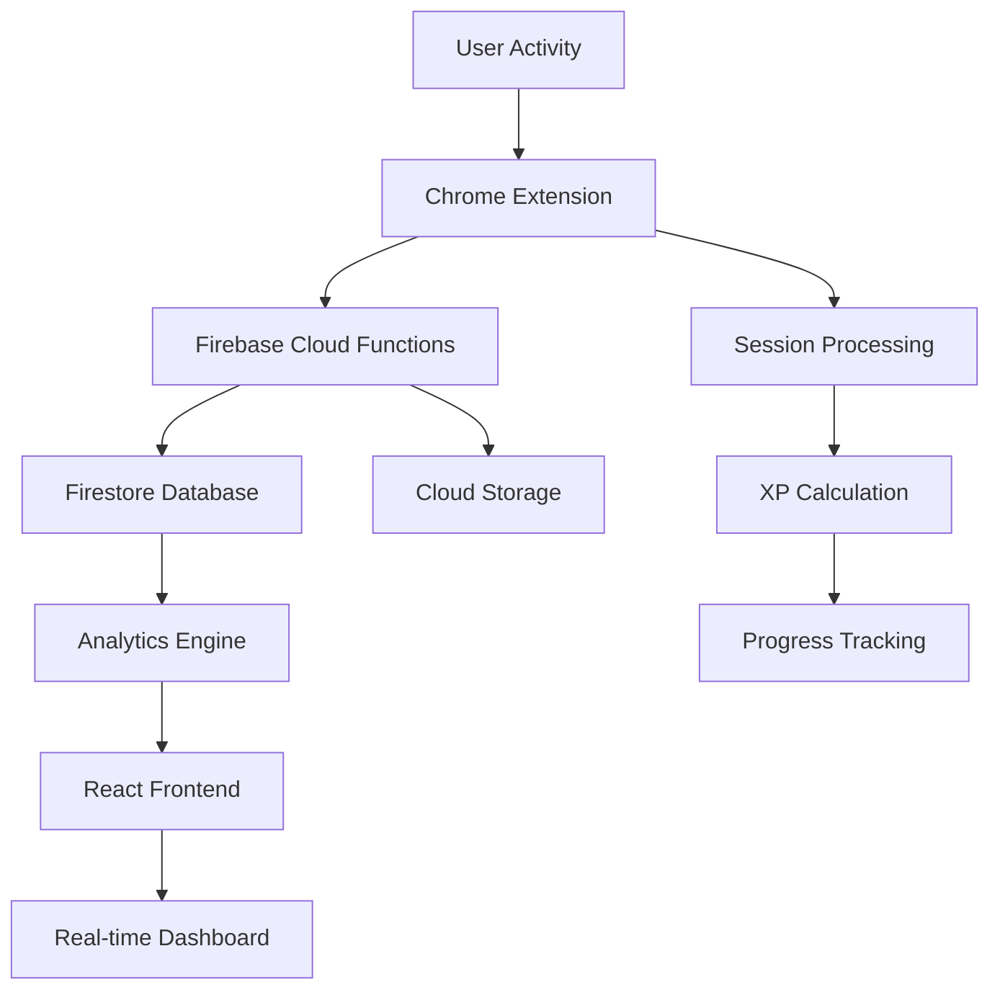

# 🚀 CodeStreak Tracker - "Duolingo for Coders"

> **A comprehensive coding activity tracking and gamification platform built with Google Cloud technologies**

[](https://cloud.google.com/)
[](https://firebase.google.com/)
[](https://developer.chrome.com/docs/extensions/)
[](https://reactjs.org/)

## 🎯 Project Overview

CodeStreak Tracker is an innovative coding activity tracking platform that gamifies the learning experience for developers. Similar to Duolingo's approach to language learning, it provides real-time tracking, progress analytics, and achievement systems to motivate consistent coding practice.

### 💡 Our Unique Approach

We recognize the fast-evolving learning landscape that provides everyone with plenty of opportunities to study, learn, and become a better engineer. However, what's missing is a **platform-independent system** to incentivize and nudge people to come back every day and embrace continuous learning.

**Imagine your friends talking about their 300-day programming streak instead of just their latest project!** 

CodeStreak Tracker bridges this gap by creating a unified gamification layer that works across all coding platforms - whether you're solving LeetCode problems, contributing to GitHub repositories, or learning from Stack Overflow. We transform the solitary act of coding into a social, engaging, and habit-forming experience that encourages daily practice and continuous improvement.

### 🌟 Key Features

- **🔍 Real-time Activity Tracking**: Monitors coding activity across popular platforms (LeetCode, GitHub, Stack Overflow, etc.)
- **📊 Advanced Analytics**: Provides detailed insights into coding patterns, productivity, and learning progress
- **🎮 Gamification System**: XP points, streaks, achievements, and leaderboards to motivate consistent practice
- **📈 Progress Visualization**: Interactive dashboards showing coding trends, topic mastery, and skill development
- **🔗 Cross-Platform Integration**: Seamlessly tracks activity across multiple coding platforms

## 🏗️ Architecture Overview



## 🛠️ Google Cloud Technologies Used

This project leverages a comprehensive suite of **Google Cloud technologies** to deliver a scalable, real-time coding activity tracking platform:

### 🔥 **Firebase Suite**
- **Firebase Cloud Functions**: Serverless backend processing for real-time data analysis
- **Firestore Database**: NoSQL document database for storing user sessions, analytics, and gamification data
- **Firebase Hosting**: Global CDN for frontend deployment

### ☁️ **Google Cloud Platform**
- **Cloud Run**: Containerized deployment of backend services (via Firebase Functions)
- **Cloud Logging**: Comprehensive logging and monitoring (via Firebase)

### 🌐 **Chrome Extension Platform**
- **Chrome Extension Manifest V3**: Modern extension architecture
- **Chrome APIs**: Tab management, storage, and messaging
- **Chrome Web Store**: Distribution platform for the extension

### 🎨 **Frontend Technologies**
- **React 18**: Modern React with hooks and concurrent features
- **TypeScript**: Type-safe development across the entire stack
- **Vite**: Fast build tool and development server
- **Tailwind CSS**: Utility-first CSS framework
- **Radix UI**: Headless UI primitives for accessible components
- **Recharts**: Interactive data visualization library

## 🚀 Quick Start

### Prerequisites
- Node.js 18+
- Google Cloud SDK
- Chrome browser for extension development

### Installation

1. **Clone the repository**
   ```bash
   git clone https://github.com/your-username/codestreak-tracker.git
   cd codestreak-tracker
   ```

2. **Set up Firebase**
   ```bash
   npm install -g firebase-tools
   firebase login
   firebase init
   ```

3. **Install dependencies**
   ```bash
   # Backend
   cd functions && npm install
   
   # Frontend
   cd ../frontend && npm install
   
   # Chrome Extension
   cd ../chrome-plugin && npm install
   ```

4. **Deploy to Google Cloud**
   ```bash
   # Deploy Firebase Functions
   cd functions && firebase deploy --only functions
   
   # Deploy Frontend
   cd ../frontend && firebase deploy --only hosting
   ```

## 📁 Project Structure

```
codestreak-tracker/
├── 📁 chrome-plugin/          # Chrome Extension (Manifest V3)
├── 📁 functions/              # Firebase Cloud Functions (Node.js)
├── 📁 frontend/               # React Frontend (TypeScript)
├── 📁 hosting/                # Static hosting configuration
└── 📄 firebase.json           # Firebase project configuration
```

## 🎮 How It Works

1. **Activity Detection**: Chrome extension monitors user activity on coding platforms
2. **Data Processing**: Firebase Cloud Functions process and analyze session data
3. **Gamification**: XP points, streaks, and achievements are calculated in real-time
4. **Analytics**: Advanced algorithms analyze coding patterns and productivity
5. **Visualization**: React frontend displays insights and progress tracking

## 🏆 Hackathon Achievements

This project was developed for the **Google Hackathon** and demonstrates expertise in:

- **Serverless Architecture**: Leveraging Firebase Cloud Functions for scalable backend processing
- **Real-time Data Processing**: Implementing efficient data pipelines with Firestore
- **Cross-Platform Integration**: Seamless Chrome extension and web application integration
- **Advanced Analytics**: Complex algorithms for coding pattern analysis and gamification
- **Modern Web Technologies**: React, TypeScript, and modern development practices

## 🤝 Contributing

We welcome contributions! Please see our [Contributing Guidelines](CONTRIBUTING.md) for details.

## 📄 License

This project is licensed under the MIT License - see the [LICENSE](LICENSE) file for details.

## 🙏 Acknowledgments

- **Google Cloud Platform** for providing the robust infrastructure
- **Firebase Team** for the excellent developer experience
- **Chrome Extension Team** for the powerful extension APIs
- **React Community** for the amazing frontend framework

---

**Built with ❤️ for the Google Hackathon**

*Transforming coding education through gamification and real-time analytics*