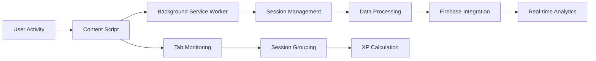

# 🔌 Chrome Extension - CodeStreak Tracker

> **Real-time coding activity tracking and session management**

## 📋 Overview

The Chrome Extension is the core component that monitors user activity across coding platforms and sends data to the Firebase backend for processing. Built with Manifest V3, it provides seamless, real-time tracking of coding sessions.

## 🏗️ Architecture



## 📁 File Structure

```
chrome-plugin/
├── 📄 manifest.json           # Extension configuration (Manifest V3)
├── 📄 background.js           # Service worker for session management
├── 📄 content.js              # Content script for page interaction
├── 📄 popup.js                # Popup UI logic and interactions
├── 📄 popup.html              # Popup UI structure
├── 📄 options.js              # Options page functionality
├── 📄 options.html            # Options page UI
├── 📄 firebase-config.js      # Firebase configuration
├── 📄 default_icon.png        # Extension icon
└── 📄 README.md               # This documentation
```

## 🚀 Key Features

### 🔍 **Activity Tracking**
- **Real-time Monitoring**: Tracks user activity across coding platforms
- **Smart Session Grouping**: Groups related activities into meaningful sessions
- **Micro-session Filtering**: Filters out sessions shorter than 5 seconds
- **Cross-platform Support**: Works with LeetCode, GitHub, Stack Overflow, and more

### 📊 **Session Management**
- **Automatic Session Detection**: Detects when users start/stop coding
- **Session Grouping**: Groups related activities into cohesive sessions
- **Manual Session Control**: Allows users to manually end sessions
- **Session Analytics**: Tracks duration, sites visited, and topics covered

### 🎮 **Gamification Integration**
- **XP Tracking**: Calculates XP based on session duration and activity
- **Streak Monitoring**: Tracks daily coding streaks
- **Achievement System**: Provides feedback on coding milestones
- **Progress Visualization**: Shows real-time progress in popup

## 🛠️ Technology Stack

### **Core Technologies**
- **Chrome Extension Manifest V3**: Modern extension architecture
- **JavaScript ES6+**: Modern JavaScript features
- **Chrome APIs**: Tab management, storage, messaging
- **Firebase SDK**: Real-time data synchronization

### **APIs Used**
- `chrome.tabs`: Tab management and monitoring
- `chrome.storage`: Local data persistence
- `chrome.runtime`: Extension lifecycle management
- `chrome.alarms`: Scheduled tasks and notifications

## 🔧 Installation & Setup

### **Development Setup**

1. **Load Extension in Chrome**
   ```
   1. Open Chrome and go to chrome://extensions/
   2. Enable "Developer mode"
   3. Click "Load unpacked"
   4. Select the chrome-plugin directory
   ```

2. **Configure Firebase**
   ```javascript
   // Update firebase-config.js with your project credentials
   const firebaseConfig = {
     apiKey: "your-api-key",
     authDomain: "your-project.firebaseapp.com",
     projectId: "your-project-id",
     // ... other config
   };
   ```

3. **Test the Extension**
   - Visit coding platforms (LeetCode, GitHub, etc.)
   - Click the extension icon to see session data
   - Use the "End Session" button to manually end sessions

### **Production Deployment**

1. **Build for Production**
   ```bash
   # No build step required - pure JavaScript
   # Ensure all files are optimized and minified
   ```

2. **Chrome Web Store Submission**
   - Create a developer account
   - Package the extension as a .zip file
   - Submit through the Chrome Web Store Developer Dashboard

## 📖 Usage Guide

### **Basic Usage**

1. **Install the Extension**: Load the extension in Chrome
2. **Start Coding**: Visit any supported coding platform
3. **Automatic Tracking**: The extension automatically tracks your activity
4. **View Progress**: Click the extension icon to see your session data
5. **Manual Control**: Use buttons to end sessions or test database connection

### **Supported Platforms**

- **LeetCode**: Problem solving and algorithm practice
- **GitHub**: Code repository management and collaboration
- **Stack Overflow**: Question answering and learning
- **MDN**: Documentation and learning
- **W3Schools**: Web development tutorials
- **And more**: Extensible to any coding-related platform

### **Session Management**

- **Automatic Sessions**: Sessions start when you visit coding platforms
- **Session Grouping**: Related activities are grouped together
- **Manual End**: Use the "End Session" button to manually end sessions
- **Session Data**: Each session includes duration, sites visited, and topics

## 🔧 Configuration

### **Manifest Configuration**

```json
{
  "manifest_version": 3,
  "name": "CodeStreak Tracker",
  "version": "1.0.0",
  "permissions": [
    "tabs",
    "storage",
    "alarms",
    "activeTab"
  ],
  "host_permissions": [
    "https://*/*",
    "http://*/*"
  ]
}
```

### **Firebase Configuration**

```javascript
// firebase-config.js
import { initializeApp } from 'firebase/app';

const firebaseConfig = {
  // Your Firebase configuration
};

const app = initializeApp(firebaseConfig);
export default app;
```

## 🐛 Troubleshooting

### **Common Issues**

1. **Extension Not Tracking**
   - Check if the extension is enabled
   - Verify permissions are granted
   - Check browser console for errors

2. **Data Not Syncing**
   - Verify Firebase configuration
   - Check network connectivity
   - Review Firebase console for errors

3. **Sessions Not Grouping**
   - Ensure you're visiting supported platforms
   - Check if sessions meet minimum duration requirements
   - Verify session grouping logic

### **Debug Mode**

Enable debug logging by setting:
```javascript
const DEBUG = true; // In background.js
```

## 🔒 Privacy & Security

### **Data Collection**
- **Minimal Data**: Only collects necessary activity data
- **Local Storage**: Sensitive data stored locally when possible
- **Encrypted Transmission**: All data encrypted in transit
- **User Control**: Users can disable tracking at any time

### **Permissions**
- **Tabs**: Required for activity monitoring
- **Storage**: Required for local data persistence
- **Alarms**: Required for scheduled tasks
- **ActiveTab**: Required for current tab information

## 🚀 Future Enhancements

- **Offline Support**: Track activity when offline
- **Advanced Analytics**: More detailed activity insights
- **Custom Platforms**: User-defined platform support
- **Team Features**: Collaborative tracking and leaderboards
- **Mobile Support**: Cross-platform synchronization

## 📚 API Reference

### **Background Script APIs**

```javascript
// Session management
startSession(tabId, url, title)
endSession(tabId, reason)
getCurrentSession(tabId)

// Data management
sendToFirebase(sessionData)
updateSessionGroup(sessionId, data)
getSessionStats()

// Utility functions
isCodingWebsite(url)
extractDomain(url)
calculateSessionDuration(start, end)
```

### **Popup APIs**

```javascript
// UI updates
updateStats()
updateSessionInfo()
showNotification(message, type)

// Event handlers
handleEndSession()
handleTestDatabase()
handleGetCurrentSession()
```

---

**Built with ❤️ for the Google Hackathon**

*Empowering developers through intelligent activity tracking*