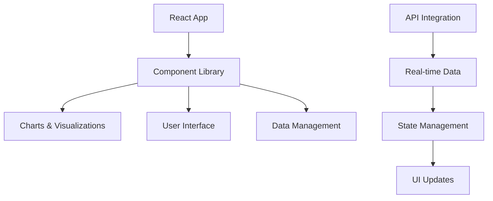

# 🎨 React Frontend - CodeStreak Dashboard

> **Modern, responsive dashboard for coding activity visualization and analytics**

## 📋 Overview

The React Frontend provides a comprehensive dashboard for visualizing coding activity, progress tracking, and gamification metrics. Built with modern web technologies, it offers an intuitive and engaging user experience for developers to track their coding journey.

## 🏗️ Architecture



## 📁 File Structure

```
frontend/
├── 📁 src/
│   ├── 📁 components/           # Reusable UI components
│   ├── 📁 pages/               # Page components
│   ├── 📁 hooks/               # Custom React hooks
│   ├── 📁 services/            # API services
│   ├── 📁 types/               # TypeScript type definitions
│   ├── 📁 utils/               # Utility functions
│   ├── 📁 styles/              # Styling files
│   ├── 📄 App.tsx              # Main application component
│   └── 📄 main.tsx             # Application entry point
├── 📁 public/                  # Static assets
├── 📄 index.html               # HTML template
├── 📄 package.json             # Dependencies and scripts
├── 📄 vite.config.ts           # Vite configuration
├── 📄 tailwind.config.ts       # Tailwind CSS configuration
└── 📄 tsconfig.json            # TypeScript configuration
```

## 🚀 Key Features

### 📊 **Interactive Dashboard**
- **Real-time Analytics**: Live updates of coding activity
- **Progress Tracking**: Visual progress indicators and milestones
- **Gamification Display**: XP points, streaks, and achievements
- **Activity Timeline**: Chronological view of coding sessions

### 📈 **Advanced Visualizations**
- **Activity Charts**: Bar charts, line graphs, and pie charts
- **Heatmaps**: Daily activity patterns and intensity
- **Progress Rings**: Circular progress indicators
- **Trend Analysis**: Historical data and trend visualization

### 🎮 **Gamification Interface**
- **XP Display**: Current XP and level progression
- **Streak Counter**: Daily coding streak visualization
- **Achievement Badges**: Unlocked achievements and milestones
- **Leaderboards**: Competitive elements and rankings

## 🛠️ Technology Stack

### **Core Technologies**
- **React 18**: Modern React with hooks and concurrent features
- **TypeScript**: Type-safe development
- **Vite**: Fast build tool and development server
- **Tailwind CSS**: Utility-first CSS framework

### **UI Components**
- **shadcn/ui**: Modern, accessible component library
- **Radix UI**: Headless UI primitives
- **Lucide React**: Beautiful icon library
- **Class Variance Authority**: Component variant management

### **Data Visualization**
- **Recharts**: Composable charting library
- **React Query**: Data fetching and caching
- **Date-fns**: Date manipulation utilities
- **React Hook Form**: Form management

## 🔧 Installation & Setup

### **Prerequisites**
- Node.js 18+
- npm or yarn
- Modern web browser

### **Development Setup**

1. **Install Dependencies**
   ```bash
   cd frontend
   npm install
   ```

2. **Configure Environment**
   ```bash
   # Create .env.local file
   VITE_API_BASE_URL=https://your-api-url.com
   VITE_FIREBASE_API_KEY=your-firebase-api-key
   VITE_FIREBASE_AUTH_DOMAIN=your-project.firebaseapp.com
   VITE_FIREBASE_PROJECT_ID=your-project-id
   ```

3. **Start Development Server**
   ```bash
   npm run dev
   ```

4. **Build for Production**
   ```bash
   npm run build
   ```

### **Available Scripts**

```bash
npm run dev          # Start development server
npm run build        # Build for production
npm run preview      # Preview production build
npm run lint         # Run ESLint
npm run type-check   # Run TypeScript checks
```

## 🔌 API Integration

### **API Client**

```typescript
// services/api.ts
class ApiClient {
  private baseURL: string;
  
  constructor(baseURL: string) {
    this.baseURL = baseURL;
  }
  
  async getSessions(params?: SessionParams): Promise<SessionResponse> {
    const response = await fetch(`${this.baseURL}/getSessions?${new URLSearchParams(params)}`);
    return response.json();
  }
  
  async getXP(): Promise<XPResponse> {
    const response = await fetch(`${this.baseURL}/getXP`);
    return response.json();
  }
}
```

### **React Query Integration**

```typescript
// hooks/useData.ts
import { useQuery } from '@tanstack/react-query';

export const useSessions = (params?: SessionParams) => {
  return useQuery({
    queryKey: ['sessions', params],
    queryFn: () => apiClient.getSessions(params),
    staleTime: 5 * 60 * 1000, // 5 minutes
  });
};

export const useXP = () => {
  return useQuery({
    queryKey: ['xp'],
    queryFn: () => apiClient.getXP(),
    staleTime: 1 * 60 * 1000, // 1 minute
  });
};
```

## 🎨 Styling & Theming

### **Tailwind CSS Configuration**

```typescript
// tailwind.config.ts
export default {
  content: ['./index.html', './src/**/*.{js,ts,jsx,tsx}'],
  theme: {
    extend: {
      colors: {
        primary: {
          50: '#eff6ff',
          500: '#3b82f6',
          900: '#1e3a8a',
        },
        secondary: {
          50: '#f0fdf4',
          500: '#22c55e',
          900: '#14532d',
        },
      },
    },
  },
  plugins: [require('tailwindcss-animate')],
};
```

## 📱 Responsive Design

### **Mobile-First Approach**

```css
/* Mobile styles (default) */
.dashboard {
  @apply p-4 space-y-4;
}

.metrics-grid {
  @apply grid grid-cols-1 gap-4;
}

/* Tablet styles */
@media (min-width: 768px) {
  .dashboard {
    @apply p-6 space-y-6;
  }
  
  .metrics-grid {
    @apply grid-cols-2 gap-6;
  }
}

/* Desktop styles */
@media (min-width: 1024px) {
  .dashboard {
    @apply p-8 space-y-8;
  }
  
  .metrics-grid {
    @apply grid-cols-4 gap-8;
  }
}
```

## 🧪 Testing

### **Unit Tests**

```typescript
// __tests__/components/XPDisplay.test.tsx
import { render, screen } from '@testing-library/react';
import { XPDisplay } from '../XPDisplay';

describe('XPDisplay', () => {
  it('displays current XP and level', () => {
    render(
      <XPDisplay
        currentXP={150}
        levelXP={100}
        nextLevelXP={200}
        level={2}
      />
    );
    
    expect(screen.getByText('Level 2')).toBeInTheDocument();
    expect(screen.getByText('150 / 200 XP')).toBeInTheDocument();
  });
});
```

## 🚀 Performance Optimization

### **Code Splitting**

```typescript
// Lazy loading for route components
const Dashboard = lazy(() => import('./pages/Dashboard'));
const Analytics = lazy(() => import('./pages/Analytics'));

// Route configuration
const App: React.FC = () => {
  return (
    <Router>
      <Suspense fallback={<LoadingSpinner />}>
        <Routes>
          <Route path="/" element={<Dashboard />} />
          <Route path="/analytics" element={<Analytics />} />
        </Routes>
      </Suspense>
    </Router>
  );
};
```

## 🚀 Deployment

### **Build Configuration**

```typescript
// vite.config.ts
export default defineConfig({
  plugins: [react()],
  build: {
    outDir: 'dist',
    sourcemap: true,
    rollupOptions: {
      output: {
        manualChunks: {
          vendor: ['react', 'react-dom'],
          charts: ['recharts'],
          ui: ['@radix-ui/react-dialog'],
        },
      },
    },
  },
});
```

## 🚀 Future Enhancements

- **Real-time Updates**: WebSocket integration for live data
- **Offline Support**: Service worker for offline functionality
- **Advanced Analytics**: Machine learning insights
- **Social Features**: Team collaboration and sharing
- **Mobile App**: React Native companion app
- **Custom Themes**: User-defined color schemes

---

**Built with ❤️ for the Google Hackathon**

*Creating beautiful, intuitive interfaces for coding education*