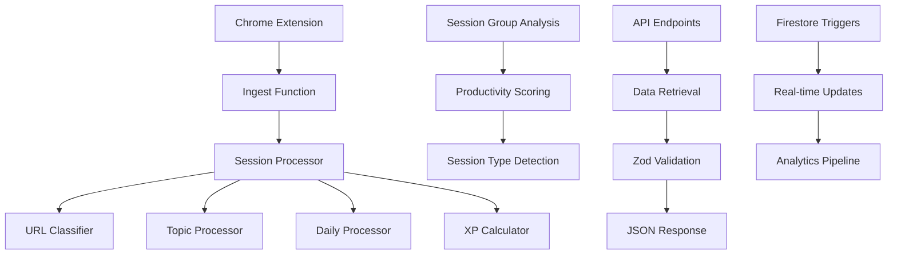

# ⚡ Firebase Cloud Functions - CodeStreak Backend

> **Serverless backend processing for real-time coding analytics and gamification**

## 📋 Overview

The Firebase Cloud Functions module provides the serverless backend infrastructure for CodeStreak Tracker. Built with Node.js and TypeScript, it processes real-time coding activity data, calculates gamification metrics, and provides comprehensive analytics through RESTful APIs.

## 🏗️ Architecture



## 📁 File Structure

```
functions/
├── 📁 src/
│   ├── 📁 config/
│   │   └── 📄 admin.ts              # Firebase Admin SDK configuration
│   ├── 📁 http/
│   │   ├── 📄 ingest.ts             # Main data ingestion endpoint
│   │   ├── 📄 getSessions.ts        # Session data retrieval API
│   │   ├── 📄 getTopics.ts          # Topic analytics API
│   │   ├── 📄 getDaily.ts           # Daily statistics API
│   │   ├── 📄 getGithub.ts          # GitHub activity API
│   │   ├── 📄 getXP.ts              # XP/gamification API
│   │   ├── 📄 getSessionsDemo.ts    # Demo session data
│   │   ├── 📄 getTopicsDemo.ts      # Demo topic data
│   │   ├── 📄 getDailyDemo.ts       # Demo daily data
│   │   ├── 📄 getGithubDemo.ts      # Demo GitHub data
│   │   └── 📄 getXPDemo.ts          # Demo XP data
│   ├── 📁 triggers/
│   │   └── 📄 sessionGroupAnalysis.ts # Firestore trigger for session analysis
│   ├── 📁 processors/
│   │   ├── 📄 sessionProcessor.ts   # Main session processing orchestrator
│   │   ├── 📄 urlClassifier.ts      # URL classification and topic extraction
│   │   ├── 📄 topicProcessor.ts     # Topic-based statistics processing
│   │   ├── 📄 dailyProcessor.ts     # Daily statistics and streak tracking
│   │   └── 📄 xpCalculator.ts       # XP calculation and gamification
│   ├── 📄 schemas.ts                # Zod validation schemas
│   └── 📄 index.ts                  # Main entry point and exports
├── 📄 package.json                  # Dependencies and scripts
├── 📄 tsconfig.json                 # TypeScript configuration
└── 📄 README.md                     # This documentation
```

## 🚀 Key Features

### 🔥 **Firebase Cloud Functions**
- **Serverless Processing**: Automatic scaling and cost optimization
- **Real-time Triggers**: Firestore triggers for instant data processing
- **HTTP Endpoints**: RESTful APIs for frontend integration
- **TypeScript Support**: Full type safety and modern development

### 📊 **Data Processing Pipeline**
- **Session Analysis**: Comprehensive session data processing
- **URL Classification**: Intelligent coding platform detection
- **Topic Extraction**: Automatic topic identification from URLs
- **Productivity Scoring**: Advanced algorithms for session evaluation

### 🎮 **Gamification System**
- **XP Calculation**: Dynamic XP based on session duration and activity
- **Streak Tracking**: Daily coding streak monitoring
- **Achievement System**: Milestone-based achievements
- **Progress Analytics**: Detailed progress tracking and insights

### 🔒 **Data Validation**
- **Zod Schemas**: Runtime type validation for all APIs
- **Input Sanitization**: Secure data processing
- **Error Handling**: Comprehensive error management
- **CORS Support**: Cross-origin request handling

## 🛠️ Technology Stack

### **Core Technologies**
- **Node.js 18**: Runtime environment
- **TypeScript**: Type-safe development
- **Firebase Cloud Functions**: Serverless backend
- **Firestore**: NoSQL database
- **Zod**: Runtime type validation

### **Google Cloud Services**
- **Firebase Cloud Functions**: Serverless compute
- **Firestore**: Document database
- **Cloud Logging**: Centralized logging
- **Cloud Monitoring**: Performance monitoring
- **Cloud Build**: CI/CD pipeline

### **Dependencies**
```json
{
  "firebase-admin": "^12.1.0",
  "firebase-functions": "^5.0.0",
  "zod": "^3.22.4"
}
```

## 🔧 Installation & Setup

### **Prerequisites**
- Node.js 18+
- Firebase CLI
- Google Cloud SDK
- TypeScript

### **Development Setup**

1. **Install Dependencies**
   ```bash
   cd functions
   npm install
   ```

2. **Configure Firebase**
   ```bash
   firebase login
   firebase use your-project-id
   ```

3. **Build TypeScript**
   ```bash
   npm run build
   ```

4. **Run Locally**
   ```bash
   npm run serve
   ```

### **Deployment**

1. **Build and Deploy**
   ```bash
   npm run build
   firebase deploy --only functions
   ```

2. **Deploy Specific Functions**
   ```bash
   firebase deploy --only functions:ingest
   firebase deploy --only functions:getXP
   ```

## 📖 API Documentation

### **Data Ingestion**

#### `POST /ingest`
Main endpoint for receiving session data from the Chrome extension.

**Request Body:**
```typescript
{
  active_ms: number;
  domain: string;
  url: string;
  title: string;
  ts_start: string; // ISO 8601
  ts_end: string;   // ISO 8601
  session_group_id: string;
  session_group_sites: string[];
  session_group_paths: string[];
  session_group_titles: string[];
  session_group_duration: number;
  session_group_position: number;
}
```

**Response:**
```typescript
{
  success: boolean;
  sessionId: string;
  processing: {
    topics: string[];
    xpGained: number;
    streakCount: number;
    sources: string[];
    isCodingWebsite: boolean;
  };
}
```

### **Data Retrieval APIs**

#### `GET /getSessions`
Retrieve user session data with pagination.

**Query Parameters:**
- `page`: Page number (default: 1)
- `limit`: Items per page (default: 50, max: 100)

**Response:**
```typescript
{
  sessions: Session[];
  pagination: {
    page: number;
    limit: number;
    total: number;
    totalPages: number;
  };
}
```

#### `GET /getXP`
Get user XP and gamification data.

**Response:**
```typescript
{
  xp: {
    total_xp: number;
    session_xp: number;
    github_xp: number;
    topic_xp: number;
    daily_xp: number;
    stream_xp: number;
  };
  last_updated: string;
}
```

#### `GET /getTopics`
Get topic-based analytics.

**Response:**
```typescript
{
  topics: {
    [topic: string]: {
      session_per_topic: number;
      total_time_spent: number;
      sources: string[];
      average_activity: number;
      average_session_length: number;
    };
  };
}
```

#### `GET /getDaily`
Get daily statistics and trends.

**Query Parameters:**
- `start_date`: Start date (YYYY-MM-DD)
- `end_date`: End date (YYYY-MM-DD)

**Response:**
```typescript
{
  daily: {
    [date: string]: {
      number_of_sessions: number;
      total_time_spent: number;
      topics_on_that_day: string[];
      avg_session_length: number;
      list_of_sources: string[];
    };
  };
}
```

#### `GET /getGithub`
Get GitHub-specific activity data.

**Response:**
```typescript
{
  github: {
    number_of_commits: number;
    lines_of_code: number;
    languages_used: string[];
  };
}
```

## 🔄 Data Processing Flow

### **1. Session Ingestion**
```typescript
// Ingest endpoint receives session data
export const ingest = onRequest(async (request, response) => {
  // Validate and process session data
  const sessionData = await validateSessionData(request.body);
  
  // Process through the complete pipeline
  const result = await processSession(sessionData);
  
  // Return processing results
  response.json(result);
});
```

### **2. Session Processing Pipeline**
```typescript
// Main session processor orchestrates the flow
export async function processSession(sessionData: SessionData) {
  // 1. Classify URLs and extract topics
  const urlClassifications = classifyUrls(sessionData.urls);
  
  // 2. Update topic statistics
  const topicStats = await updateTopicStats(uid, topics);
  
  // 3. Update daily statistics
  const dailyStats = await updateDailyStats(uid, date, sessionData);
  
  // 4. Update streak tracking
  const streakData = await updateStreak(uid, date);
  
  // 5. Calculate and update XP
  const xpResult = await processSessionXP(uid, duration, streakCount);
  
  return { topicStats, dailyStats, streakData, xpResult };
}
```

### **3. Real-time Triggers**
```typescript
// Firestore trigger for session group analysis
export const onSessionGroupCreated = onDocumentCreated(
  "users/{uid}/session_groups/{groupId}",
  async (event) => {
    const sessionGroupData = event.data?.data();
    
    // Analyze session group
    const analysis = await analyzeSessionGroup(sessionGroupData);
    
    // Store analysis results
    await storeSessionAnalysis(uid, groupId, analysis);
  }
);
```

## 🎯 Gamification Logic

### **XP Calculation**
```typescript
// Session XP: 1 XP per minute, minimum 1 XP
const sessionXP = Math.max(1, Math.round(durationMinutes));

// Streak XP: 2 XP per streak day
const streakXP = 2 * streakCount;

// Topic XP: 25 XP per unique topic
const topicXP = uniqueTopics.length * 25;

// Daily XP: 10 XP per day with activity
const dailyXP = activeDays * 10;
```

### **Session Type Detection**
- **Algorithm Practice**: LeetCode problems, coding challenges
- **Code Review**: GitHub pull requests, code reviews
- **Problem Solving**: Stack Overflow questions, debugging
- **Learning**: Documentation, tutorials, courses
- **Bug Fixing**: Issue resolution, debugging sessions
- **Code Exploration**: Repository browsing, code discovery
- **Focused Coding**: Long, uninterrupted coding sessions
- **Mixed Activity**: Multiple types in one session

## 🔒 Security & Validation

### **Input Validation**
```typescript
// Zod schema validation
const SessionSchema = z.object({
  duration: z.number().int().nonnegative(),
  sources: z.array(Source).default([]),
  topics: z.array(z.string()).default([]),
  start_time: z.string().datetime(),
  end_time: z.string().datetime(),
});

// Runtime validation
const validatedData = SessionSchema.parse(request.body);
```

### **Authentication**
```typescript
// Mock token authentication for demo
const token = request.headers.authorization?.replace('Bearer ', '');
if (token?.startsWith('mock_token_')) {
  const uid = token.replace('mock_token_', '');
  // Process with authenticated user
}
```

## 🚀 Performance Optimization

### **Caching Strategies**
- **Session Data**: Cached for 5 minutes
- **XP Calculations**: Cached for 1 minute
- **Topic Statistics**: Cached for 10 minutes

### **Batch Processing**
- **Multiple Sessions**: Process in batches for efficiency
- **Bulk Updates**: Use Firestore batch writes
- **Async Processing**: Non-blocking data processing

### **Error Handling**
```typescript
try {
  const result = await processSession(sessionData);
  response.json({ success: true, ...result });
} catch (error) {
  logger.error("Session processing failed", { error, sessionData });
  response.status(500).json({ 
    success: false, 
    error: "Internal server error" 
  });
}
```

## 🧪 Testing

### **Unit Tests**
```bash
npm test
```

### **Integration Tests**
```bash
npm run test:integration
```

### **Load Testing**
```bash
npm run test:load
```

## 📊 Monitoring & Logging

### **Cloud Logging**
```typescript
import * as logger from "firebase-functions/logger";

logger.info("Session processed", {
  uid,
  sessionId,
  duration,
  topics,
  xpGained
});
```

### **Error Monitoring**
```typescript
logger.error("Processing failed", {
  error: error.message,
  stack: error.stack,
  context: { uid, sessionData }
});
```

## 🚀 Future Enhancements

- **Machine Learning**: AI-powered productivity insights
- **Real-time Collaboration**: Team-based tracking
- **Advanced Analytics**: Predictive modeling
- **Mobile Integration**: Cross-platform synchronization
- **Custom Metrics**: User-defined tracking parameters

---

**Built with ❤️ for the Google Hackathon**

*Powering the future of coding education through intelligent analytics*
