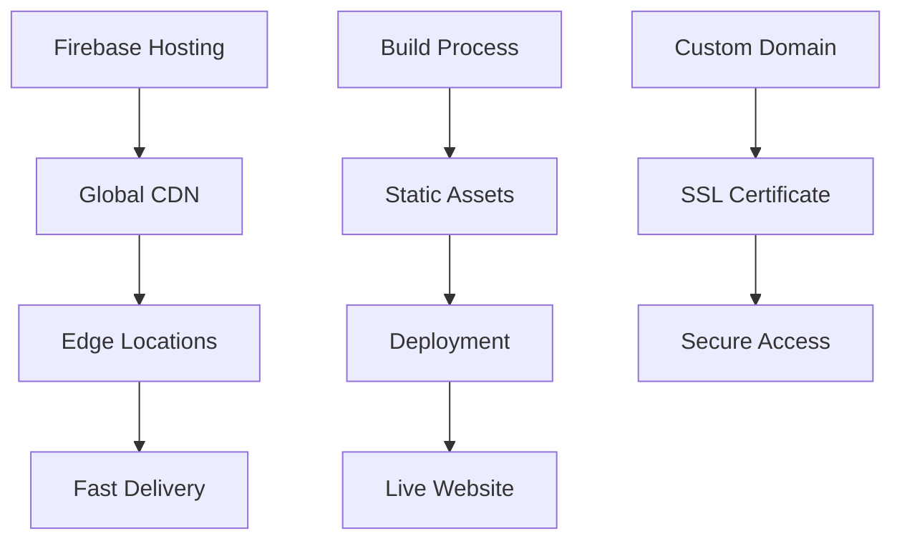

# 🌐 Firebase Hosting - CodeStreak Web App

> **Global CDN hosting for the CodeStreak web application**

## 📋 Overview

Firebase Hosting provides fast, secure, and reliable hosting for the CodeStreak web application. It delivers the frontend application through Google's global CDN network, ensuring optimal performance and availability worldwide.

## 🏗️ Architecture



## 📁 File Structure

```
hosting/
├── 📄 index.html               # Main HTML template
├── 📄 package.json             # Hosting dependencies
├── 📁 public/                  # Static assets
│   └── 📄 vite.svg             # Vite logo
└── 📄 README.md                # This documentation
```

## 🚀 Key Features

### 🌍 **Global CDN**
- **Edge Locations**: Content served from 200+ locations worldwide
- **Fast Delivery**: Sub-second loading times globally
- **Automatic Scaling**: Handles traffic spikes automatically
- **DDoS Protection**: Built-in security and protection

### 🔒 **Security & Performance**
- **SSL Certificates**: Automatic HTTPS with Let's Encrypt
- **HTTP/2 Support**: Modern protocol for faster loading
- **Gzip Compression**: Automatic compression for smaller file sizes
- **Cache Headers**: Optimized caching strategies

### 🛠️ **Developer Experience**
- **One-Command Deploy**: Simple deployment process
- **Rollback Support**: Easy rollback to previous versions
- **Custom Domains**: Support for custom domain names
- **Environment Variables**: Secure configuration management

## 🛠️ Technology Stack

### **Hosting Platform**
- **Firebase Hosting**: Google's hosting service
- **Global CDN**: Google's edge network
- **SSL/TLS**: Automatic certificate management
- **Custom Domains**: Domain configuration support

### **Build Tools**
- **Vite**: Modern build tool for frontend
- **TypeScript**: Type-safe development
- **Tailwind CSS**: Utility-first CSS framework
- **PostCSS**: CSS processing and optimization

## 🔧 Installation & Setup

### **Prerequisites**
- Firebase CLI installed
- Firebase project configured
- Node.js 18+

### **Initial Setup**

1. **Install Firebase CLI**
   ```bash
   npm install -g firebase-tools
   ```

2. **Login to Firebase**
   ```bash
   firebase login
   ```

3. **Initialize Hosting**
   ```bash
   firebase init hosting
   ```

4. **Configure Firebase**
   ```bash
   # Select your Firebase project
   # Choose public directory (usually 'dist' or 'build')
   # Configure as single-page app (yes)
   # Set up automatic builds (optional)
   ```

### **Deployment**

1. **Build the Application**
   ```bash
   cd frontend
   npm run build
   ```

2. **Deploy to Firebase**
   ```bash
   firebase deploy --only hosting
   ```

3. **Deploy Everything**
   ```bash
   firebase deploy
   ```

## 📖 Configuration

### **Firebase Configuration**

```json
// firebase.json
{
  "hosting": {
    "public": "dist",
    "ignore": [
      "firebase.json",
      "**/.*",
      "**/node_modules/**"
    ],
    "rewrites": [
      {
        "source": "**",
        "destination": "/index.html"
      }
    ],
    "headers": [
      {
        "source": "**/*.@(js|css)",
        "headers": [
          {
            "key": "Cache-Control",
            "value": "max-age=31536000"
          }
        ]
      }
    ]
  }
}
```

### **Build Configuration**

```typescript
// vite.config.ts
export default defineConfig({
  plugins: [react()],
  build: {
    outDir: 'dist',
    sourcemap: false,
    minify: 'terser',
    rollupOptions: {
      output: {
        manualChunks: {
          vendor: ['react', 'react-dom'],
          charts: ['recharts'],
          ui: ['@radix-ui/react-dialog'],
        },
      },
    },
  },
  base: '/', // For Firebase Hosting
});
```

## 🌐 Custom Domain Setup

### **Domain Configuration**

1. **Add Custom Domain**
   ```bash
   firebase hosting:sites:create your-custom-domain
   ```

2. **Configure DNS**
   ```
   # Add these DNS records to your domain provider:
   A     @     151.101.1.195
   A     @     151.101.65.195
   CNAME www   your-project.web.app
   ```

3. **Verify Domain**
   ```bash
   firebase hosting:sites:get your-custom-domain
   ```

### **SSL Certificate**

Firebase automatically provisions SSL certificates for custom domains:
- **Let's Encrypt**: Free SSL certificates
- **Automatic Renewal**: Certificates auto-renew
- **HTTP/2 Support**: Modern protocol support
- **HSTS Headers**: Security headers included

## 📊 Performance Optimization

### **Caching Strategy**

```json
// firebase.json - Cache headers
{
  "hosting": {
    "headers": [
      {
        "source": "**/*.@(js|css)",
        "headers": [
          {
            "key": "Cache-Control",
            "value": "max-age=31536000"
          }
        ]
      },
      {
        "source": "**/*.@(jpg|jpeg|gif|png|svg|webp)",
        "headers": [
          {
            "key": "Cache-Control",
            "value": "max-age=31536000"
          }
        ]
      },
      {
        "source": "**/*.@(html|json)",
        "headers": [
          {
            "key": "Cache-Control",
            "value": "max-age=3600"
          }
        ]
      }
    ]
  }
}
```

### **Compression**

Firebase Hosting automatically applies:
- **Gzip Compression**: Reduces file sizes by 70-80%
- **Brotli Compression**: Additional compression for modern browsers
- **Image Optimization**: Automatic image optimization
- **Minification**: CSS and JavaScript minification

## 🔒 Security Features

### **HTTPS Enforcement**

```json
// firebase.json - Security headers
{
  "hosting": {
    "headers": [
      {
        "source": "**",
        "headers": [
          {
            "key": "Strict-Transport-Security",
            "value": "max-age=31536000; includeSubDomains"
          },
          {
            "key": "X-Content-Type-Options",
            "value": "nosniff"
          },
          {
            "key": "X-Frame-Options",
            "value": "DENY"
          },
          {
            "key": "X-XSS-Protection",
            "value": "1; mode=block"
          }
        ]
      }
    ]
  }
}
```

### **Content Security Policy**

```html
<!-- index.html -->
<meta http-equiv="Content-Security-Policy" 
      content="default-src 'self'; 
               script-src 'self' 'unsafe-inline' https://www.gstatic.com; 
               style-src 'self' 'unsafe-inline' https://fonts.googleapis.com; 
               font-src 'self' https://fonts.gstatic.com; 
               img-src 'self' data: https:; 
               connect-src 'self' https://api.codestreak.com;">
```

## 📈 Monitoring & Analytics

### **Firebase Analytics**

```typescript
// Initialize Firebase Analytics
import { getAnalytics } from 'firebase/analytics';

const analytics = getAnalytics(app);

// Track custom events
import { logEvent } from 'firebase/analytics';

logEvent(analytics, 'page_view', {
  page_title: 'Dashboard',
  page_location: window.location.href,
});
```

### **Performance Monitoring**

```typescript
// Initialize Performance Monitoring
import { getPerformance } from 'firebase/performance';

const perf = getPerformance(app);

// Track custom metrics
import { trace } from 'firebase/performance';

const t = trace(perf, 'api_call');
t.start();
// ... API call
t.stop();
```

## 🚀 CI/CD Pipeline

### **GitHub Actions**

```yaml
# .github/workflows/deploy.yml
name: Deploy to Firebase Hosting

on:
  push:
    branches: [main]

jobs:
  build_and_deploy:
    runs-on: ubuntu-latest
    steps:
      - uses: actions/checkout@v3
      
      - name: Setup Node.js
        uses: actions/setup-node@v3
        with:
          node-version: '18'
          
      - name: Install dependencies
        run: |
          cd frontend
          npm ci
          
      - name: Build
        run: |
          cd frontend
          npm run build
          
      - name: Deploy to Firebase
        uses: FirebaseExtended/action-hosting-deploy@v0
        with:
          repoToken: '${{ secrets.GITHUB_TOKEN }}'
          firebaseServiceAccount: '${{ secrets.FIREBASE_SERVICE_ACCOUNT }}'
          channelId: live
          projectId: your-project-id
```

### **Automatic Deployments**

```bash
# Deploy on push to main branch
firebase hosting:channel:deploy live

# Deploy to preview channel
firebase hosting:channel:deploy preview

# Deploy with custom build
firebase deploy --only hosting --project your-project-id
```

## 🧪 Testing & Quality Assurance

### **Performance Testing**

```bash
# Lighthouse CI
npm install -g @lhci/cli

# Run performance tests
lhci autorun --upload.target=temporary-public-storage
```

### **Security Testing**

```bash
# Security headers check
curl -I https://your-domain.com

# SSL configuration check
npx ssl-checker your-domain.com
```

## 📊 Analytics & Monitoring

### **Firebase Console**

- **Hosting Usage**: Bandwidth and request metrics
- **Performance**: Core Web Vitals tracking
- **Errors**: Error reporting and monitoring
- **Analytics**: User behavior and engagement

### **Custom Monitoring**

```typescript
// Custom performance monitoring
const monitorPerformance = () => {
  // Track Core Web Vitals
  import('web-vitals').then(({ getCLS, getFID, getFCP, getLCP, getTTFB }) => {
    getCLS(console.log);
    getFID(console.log);
    getFCP(console.log);
    getLCP(console.log);
    getTTFB(console.log);
  });
};
```

## 🚀 Future Enhancements

- **Edge Functions**: Server-side rendering at the edge
- **Advanced Caching**: Intelligent cache invalidation
- **A/B Testing**: Feature flagging and experimentation
- **Multi-region**: Geographic distribution optimization
- **CDN Optimization**: Advanced content delivery strategies

---

**Built with ❤️ for the Google Hackathon**

*Delivering lightning-fast web experiences worldwide*
